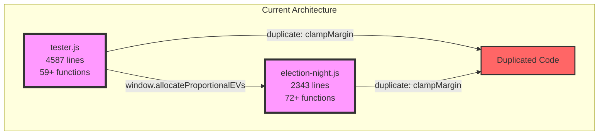
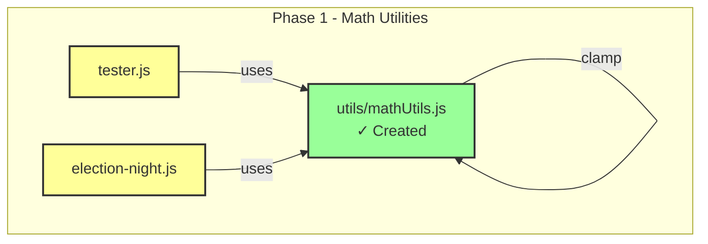
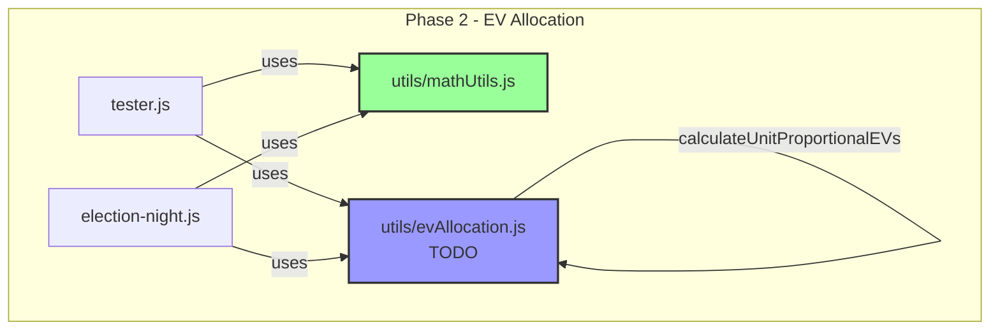
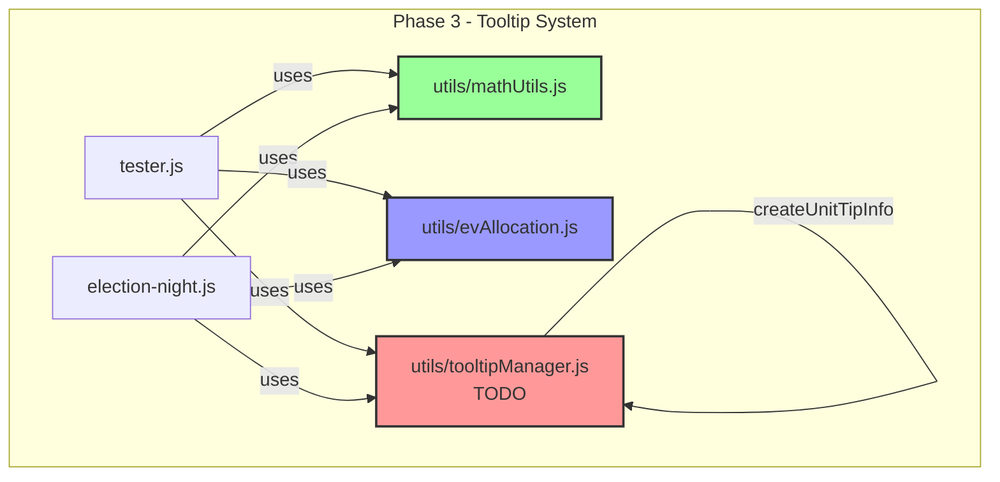
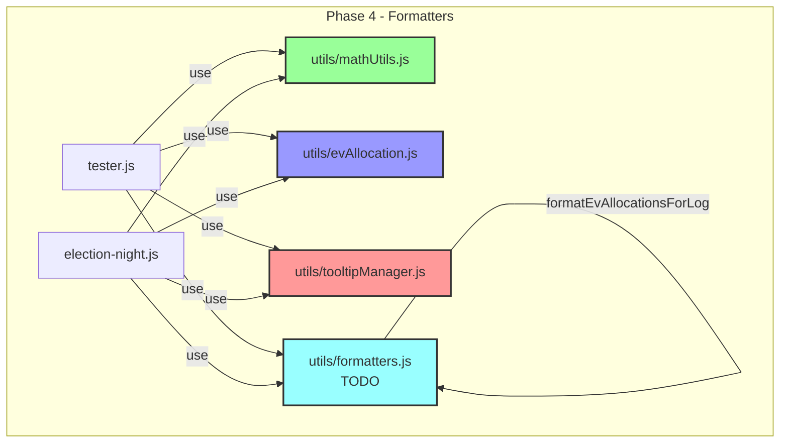
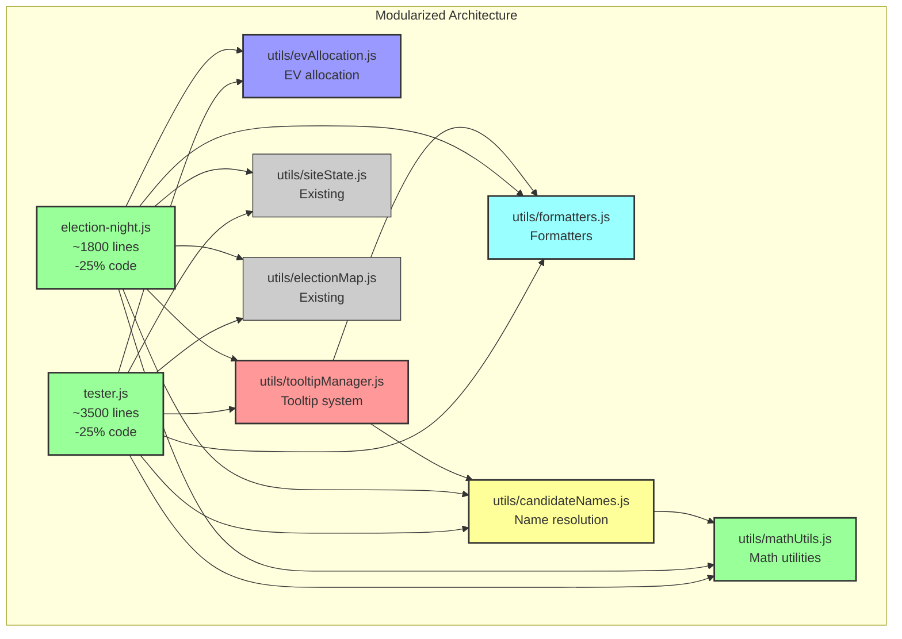

# Dependency Graph Visualization

## Current State (Before Modularization)

## Phase 1: Math Utilities (✓ COMPLETED)

**Functions Extracted:**
- ✓ `clampMargin(value)` - Clamp margin to [-1+ε, 1-ε]
- ✓ `clamp01(x)` - Clamp to [0, 1]
- ✓ `clampShare(value)` - Clamp share to (0, 1]
- ✓ `clampByte(v)` - Clamp to [0, 255] for RGB
- ✓ `clamp(value, min, max)` - Generic clamp

**Status:** ✓ Module created and tested. Ready for integration.

## Phase 2: EV Allocation (NEXT)

**Functions to Extract:**
- `allocateProportionalEVs(dVotes, rVotes, oVotes, totalEVs, topThirdPartyShare, thirdPartyResults)`
- `calculateUnitProportionalEVs(unit)` (or refactored version)
- Related helper functions

## Phase 3: Tooltip System (HIGH PRIORITY)

**Functions to Extract:**
- `showMapTip(evt, text)` - Show tooltip
- `hideMapTip()` - Hide tooltip  
- `moveMapTip(evt)` - Move tooltip
- `formatUnitTooltip(unit, opts)` - Format tooltip with candidate names
- `createUnitTipInfo(unit, opts)` - Create tooltip info object
- Helper functions: `_ensureTip()`, `_placeTipAt(evt)`

**Impact:** This directly addresses the stated problem - candidate names in tooltips only work in tester.js, not election-night.js.

## Phase 4: Formatting Utilities

**Functions to Extract:**
- `formatLeader(code)` - Format D/R/O leader code
- `formatMarginText(marginStr, leader)` - Format margin with leader
- `formatReportingText(reporting)` - Format reporting percentage
- `formatConfidenceText(confidence)` - Format confidence level
- `formatLean(value)` - Format lean value
- `formatUnitLabel(unit)` - Format unit/state label
- `formatEvAllocationsForLog(callAlloc, finalAlloc)` - Format EV allocations

## Target Architecture (After All Phases)

## Function Dependencies Analysis

### Confirmed Duplicates
- `clampMargin` - ✓ Extracted to mathUtils.js
- `init` - Different implementations, not extractable

### Functions Used But Not Defined (External Dependencies)
**tester.js:** isFinite, Number, parseInt, String, isNaN, parseFloat, proj, setTimeout, fetch
**election-night.js:** isFinite, parseFloat, String, cancelAnimationFrame, requestAnimationFrame, rng, rand, parseInt

### Target Functions Location
| Function | tester.js | election-night.js | Status |
|----------|-----------|-------------------|--------|
| clampMargin | ✓ defined | ✓ defined | ✓ Extracted |
| clamp01 | - | ✓ defined | ✓ Extracted |
| clampByte | - | ✓ defined | ✓ Extracted |
| clampShare | ✓ defined | - | ✓ Extracted |
| allocateProportionalEVs | ✓ defined | used | Phase 2 |
| formatUnitTooltip | ✓ defined | - | Phase 3 |
| showMapTip | ✓ defined | - | Phase 3 |
| hideMapTip | ✓ defined | - | Phase 3 |
| formatLeader | - | ✓ defined | Phase 4 |
| formatMarginText | - | ✓ defined | Phase 4 |

## Benefits of Modularization

### Code Quality
- ✓ Single source of truth for each function
- ✓ Easier to test in isolation
- ✓ Better documentation with JSDoc
- ✓ Clearer dependencies

### Maintainability
- ✓ Features added to modules automatically available everywhere
- ✓ Bug fixes propagate automatically
- ✓ Smaller, more focused files
- ✓ Easier code review

### Consistency
- ✓ Same behavior across all pages
- ✓ Candidate names in tooltips everywhere (Phase 3 goal)
- ✓ Consistent formatting
- ✓ Consistent EV calculations

### Developer Experience
- ✓ IDE autocomplete with JSDoc
- ✓ Easier to understand codebase
- ✓ Faster onboarding for new developers
- ✓ Clear module boundaries

## Implementation Notes

1. **Backward Compatibility**: During transition, modules export to both `window.ModuleName` and individual `window.functionName` globals
2. **No Breaking Changes**: Existing code continues to work during gradual migration
3. **Incremental Adoption**: Each phase can be deployed independently
4. **Testing**: Each module tested in isolation before integration
5. **Documentation**: JSDoc comments for all public functions
